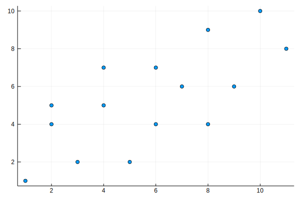
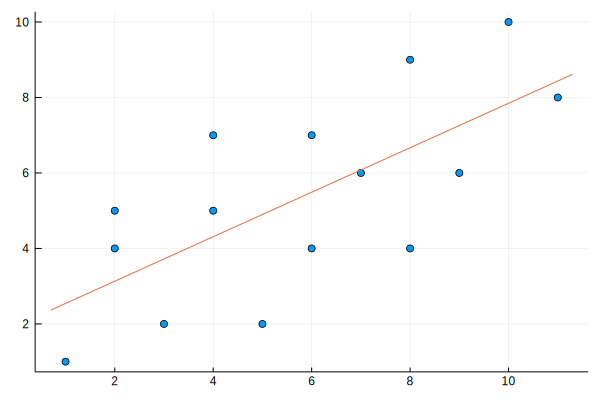

# 最小二乗法

最小二乗法による単回帰分析をします  
以下はデータの入力です  
これらのｘとｙはｎ番目とｎ番目が対応しています  
ここから直線のモデルを作成するのが今回の目標です


```julia
x=[10,4,2,2,8,9,7,5,1,3,4,6,8,11,6]
y=[10,5,5,4,4,6,6,2,1,2,7,7,9,8,4]
```


    15-element Array{Int64,1}:
     10
      5
      5
      4
      4
      6
      6
      2
      1
      2
      7
      7
      9
      8
      4


## 確認
データを確認してみます


```julia
using Plots
gr()
```


    Plots.GRBackend()


```julia
scatter(x,y,legend = false)
```





なるほど

## 何をするか

今回使用する手法は、単回帰分析の一つである最小二乗法です  
単回帰分析とは変数が一つしか使えない多項式のうち、一番実際のデータと近いものを作ろうという意味です  
最小二乗法は「近い」の定義を「誤差の二乗の和が最小」と定めるという意味です  
今回は真の回帰式が y=ax+b の形と仮定して行います  

## aを求めます

aは相関係数であり、共分散をｘの分散で割ると求まります  
あれ、そういえばぼくって「なんでこの式で傾きが求まるのか」を知らないのでは？  
フォロワー教えて下さい…  


```julia
@show n = length(x)                                             # 要素の個数
@show xmean = sum(x) / n                                        # xの平均
@show ymean = sum(y) / n                                        # yの平均
@show xvar = sum([x[i] ^ 2 - xmean ^ 2 for i=1:n]) / n         # xの分散
@show cov = sum([x[i] * y[i] - xmean * ymean for i=1:n]) / n   # 共分散
a=cov / xvar                                                    # a
```

    n = length(x) = 15
    xmean = sum(x) / n = 5.733333333333333
    ymean = sum(y) / n = 5.333333333333333
    xvar = sum([x[i] ^ 2 - xmean ^ 2 for i = 1:n]) / n = 8.862222222222224
    cov = sum([x[i] * y[i] - xmean * ymean for i = 1:n]) / n = 5.222222222222223
    


    0.5892678034102307


ここでは分散公式及び共分散公式を用いました  
馴染み深くない人はびっくりしたかもしれません

## bを求めます

y=a * x+b  
⇔(y-ymean)=a * (x-xmean)  なので


```julia
b=ymean-a*xmean
```


    1.9548645937813438


## 確認してみます


```julia
scatter(x,y,legend = false)
plot!(x->a*x+b)
```





なるほど
